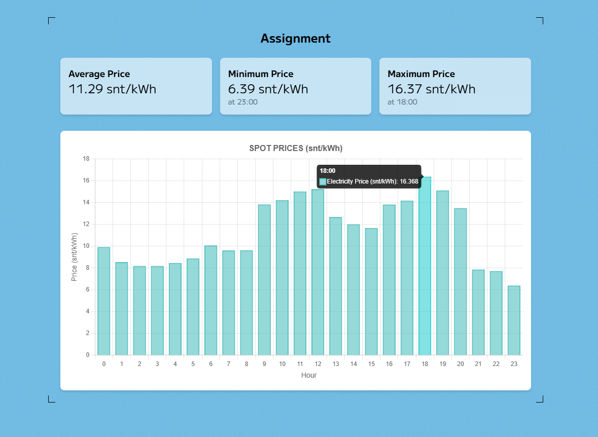

# Ohjelmointitehtävä – Akamon

Tämä repositorio sisältää React-sovelluksen, joka näyttää sähkön spot-hinnan annetun vuorokauden ajalta. Sovellus on toteutettu Reactilla ja TypeScriptillä, ja se käyttää JSON-tiedostosta haettua dataa. Hinnat näytetään yksikössä snt/kWh, ja niihin on lisätty sähkön arvonlisävero.

## Vaatimukset

- **Teknologiat**: 🛠️ React + TypeScript + TailwindCSS
- **Datan lähde**: 📂 JSON-tiedosto, haettu käyttämällä fetch API:a.
- **Yksikönmuunnos**: 💱 EUR/MWh → snt/kWh
- **Arvonlisävero**: Hintoihin lisätty sähkön arvonlisävero.
- **Responsiivisuus**: 📱💻 Sovellus toimii sekä mobiili- että työpöytälaitteilla.

## Reflektio

Aloitin luomalla uuden Vite-projektin tutuilla konfiguraatiotiedostoilla, kuten ESLint ja Prettier, joilla varmistin koodin laadun ja yhdenmukaisuuden. Tämän jälkeen rakensin projektille karkean rakenteen, jota sitten täydensin.

Ensimmäiseksi keskittyin utility-funktioiden luomiseen ja niiden testaamiseen. Tässä vaiheessa huomasin, kuinka hankalaa liukulukuaritmetiikka voi olla, erityisesti testauksen kannalta. Tämän vuoksi päätin käyttää fraction.js-kirjastoa, joka tarjoaa tarkan aritmeettisen laskennan ja helpottaa testien luomista. Tämä ratkaisi liukulukuarvojen epätarkkuusongelmat ja teki testauksesta luotettavampaa.

Samalla tutustuin Chart.js:n dokumentaatioon ja opettelin, kuinka sitä käytetään tehokkaasti/oikeaoppisesti React-sovelluksissa. Koitin myös mielenkiintoisia yhteisön tekemiä lisäosia.

Seuraavaksi toteutin datan hakulogiikan. Käytin SWR:ää, joka tarjoaa valmiit ratkaisut datan hakemiseen, välimuistittamiseen ja virheiden käsittelyyn. Tein myös vaihtoehtoisen version tavallisella Fetch API:lla ([tässä](./src/services/fetchAPIWithoutSWR.ts)).

Lopuksi yhdistin kaikki osat valmiiksi sovellukseksi. Kokonaisuudessaan projekti oli mielenkiintoinen ja opettavainen kokemus. Hyödynsin työssäni paljon DeepSeek-tekoälyä tiedonhankinnassa, testitapausten luomisessa ja kommenttien (JS Docs) kirjoittamisessa. Olen ollut viime päivinä töissä päiväkodissa eikä minulla ole riittänyt jaksaminen ohjelmoida työpäivien jälkeen. Tämän vuoksi palautus menikin näin viime tinkaan. Odotan kuitenkin innolla palautetta työstäni!

### Mitä olisin halunnut lisätä/parantaa

- Chartin ulkoasua ja käyttökokemusta erityisesti mobiilitilassa.
- Parempaa virheenkäsittelyä.
- Pieniä yksityiskohtia ja viimeistelyä eri kohdissa.
